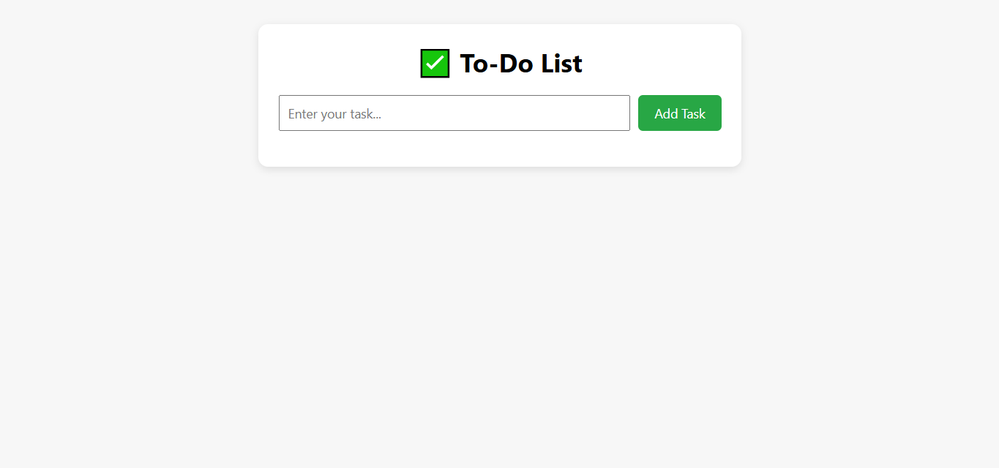

# ✅ To-Do List Web App with Local Storage

This is a simple and efficient **To-Do List Web App** created using **HTML, CSS, and JavaScript**.  
It allows users to manage daily tasks — add, check, and delete — while storing data in the browser's **localStorage** so that tasks persist even after refreshing the page.

---

## 🚀 Features

- ➕ Add new tasks
- 🗑️ Delete individual tasks
- 🔁 Data is saved in `localStorage`
- 🔄 Tasks are shown automatically on page reload
- 🎨 Simple and clean UI

---

## 🧠 Technologies Used

- HTML5
- CSS3
- JavaScript (DOM Manipulation + localStorage)

## 📸 Screenshot

